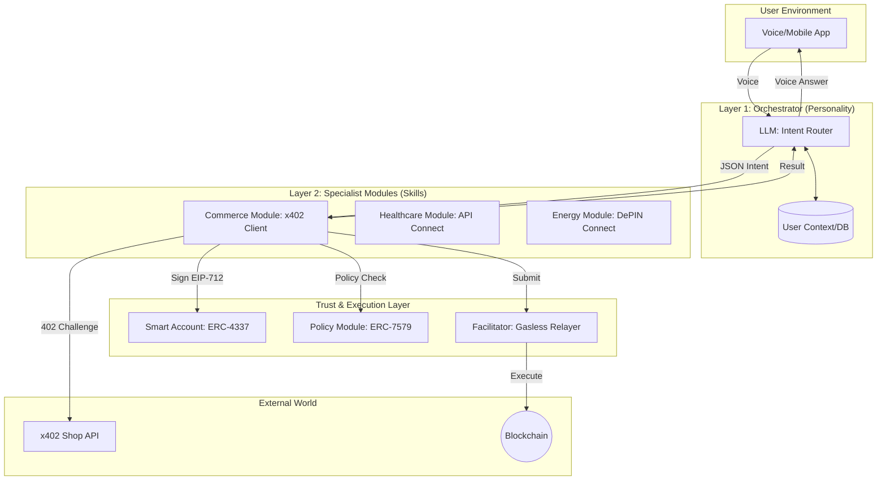

# System Overview: 全体図

システムの全体設計図です。投資家やアーキテクトが最も読む部分です。

## ターゲット・アーキテクチャ図

```mermaid
graph TD
    subgraph "User Environment"
        UA[Voice/Mobile App]
    end

    subgraph "Layer 1: Orchestrator (Personality)"
        L1_AI[LLM: Intent Router]
        Memory[(User Context/DB)]
    end

    subgraph "Layer 2: Specialist Modules (Skills)"
        L2_Comm[Commerce Module: x402 Client]
        L2_Health[Healthcare Module: API Connect]
        L2_Energy[Energy Module: DePIN Connect]
    end

    subgraph "Trust & Execution Layer"
        Wallet[Smart Account: ERC-4337]
        Policy[Policy Module: ERC-7579]
        Faci[Facilitator: Gasless Relayer]
    end

    subgraph "External World"
        Shop_API[x402 Shop API]
        Chain((Blockchain))
    end

    %% Flow
    UA -->|Voice| L1_AI
    L1_AI <--> Memory
    L1_AI -->|JSON Intent| L2_Comm
    L2_Comm -->|402 Challenge| Shop_API
    L2_Comm -->|Policy Check| Policy
    L2_Comm -->|Sign EIP-712| Wallet
    L2_Comm -->|Submit| Faci
    Faci -->|Execute| Chain
    L2_Comm -->|Result| L1_AI
    L1_AI -->|Voice Answer| UA
```

## システム構成の概要

このシステムは、L1/L2/Facilitator/Shopの関係によって構成されています。

