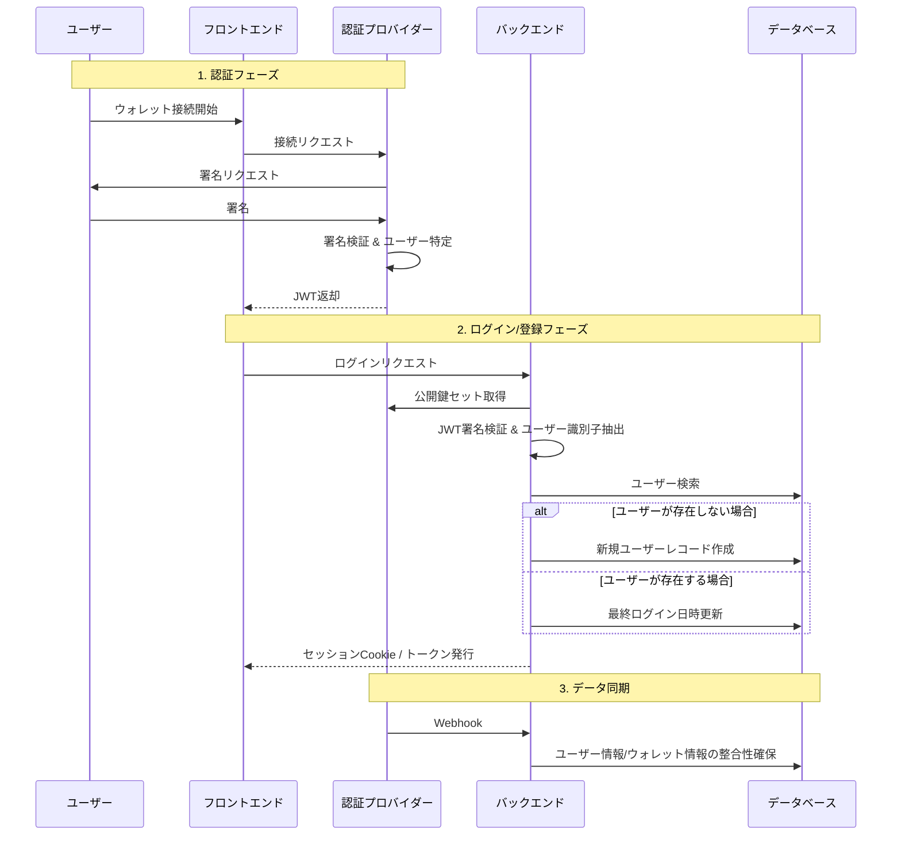

# 認証基盤アーキテクチャ設計

本ドキュメントは、フロントエンド、バックエンド、認証プロバイダーを連携した認証基盤の**アーキテクチャ設計**を定義する。

## 1. 技術選定

本プロジェクトでは、以下の技術を採用する。

- **認証プロバイダー**: Dynamic
- **フロントエンド**: Next.js
- **バックエンド**: Rust

## 2. 用語定義

本ドキュメントで使用する主要な用語を以下に定義する。

| 用語 | 説明 |
|------|------|
| **フロントエンド** | 認証ウィジェットを使用してユーザー認証を開始し、バックエンドと通信する。 |
| **バックエンド** | リソースサーバーとして機能し、JWT検証、セッション管理、ユーザーデータ管理を担当する。 |
| **認証プロバイダー** | IdPとして機能し、ウォレット接続、署名検証、JWT発行を担当する。 |

## 3. アーキテクチャ概要

### 3.1 設計のポイント

:::info
データベースのユーザー特定には、ウォレットアドレスではなく **認証プロバイダーのユーザーID** を主キーとして使用する。これにより、将来的なマルチチェーン対応やメールログイン導入時のDB改修コストを最小化する。
:::

## 4. アーキテクチャ図

フロントエンド、認証プロバイダー、バックエンドの連携フローを示す。

## 5. 認証・登録フロー詳細

### 5.1 クライアントサイド認証

フロントエンドは認証ウィジェットを使用し、ユーザーに署名を要求する。
署名完了後、認証成功イベントにてJWTを取得し、即座にバックエンドのログインエンドポイントへ送信する。

### 5.2 サーバーサイド検証

バックエンドは、フロントエンドを信頼せず、以下の手順で厳格な検証を行う。

1. **公開鍵セットの取得**: 認証プロバイダーのエンドポイントから公開鍵セットを取得。キャッシュ利用を推奨。
2. **JWT署名検証**: 取得した公開鍵を用いて、送られてきたトークンの正当性を検証。
3. **クレーム確認**:
   - 有効期限の確認。
   - ユーザー識別子クレームから認証プロバイダーのユーザーIDを取得。
   - 追加認証要件のチェック。

### 5.3 ユーザープロビジョニング

検証に成功した場合、データベースへの問い合わせを行う。

- **既存ユーザー**: ログイン処理へ進む。
- **新規ユーザー**: JWTに含まれる情報を用いて、即座にデータベースへレコードを作成する。

## 6. API インターフェース仕様

バックエンドで実装すべき最小限のエンドポイント定義。

### ログインエンドポイント

- **目的**: ログインおよび新規登録処理。
- **リクエスト**: 認証トークンをBodyに含む。
- **レスポンス**: 成功時、セキュリティ属性付きセッションCookieをSet-Cookieする。
- **処理概要**: 前述のJWT検証を行い、データベースと同期してセッションを発行する。

### ログアウトエンドポイント

- **目的**: ログアウト処理。
- **処理概要**: セッションCookieを破棄する。

### ユーザー情報取得エンドポイント

- **目的**: ログイン中のユーザー自身のプロフィール取得。
- **要件**: 有効なセッションCookieが必要。
- **レスポンス**: ユーザーID、ニックネーム、アイコン、保有ポイント等。

### Webhookエンドポイント

- **目的**: 認証プロバイダー側でのイベントをデータベースに反映する。
- **セキュリティ**: Webhook Secretを用いた署名検証を必ず行うこと。
- **主なイベント**: ユーザー作成、ユーザー更新
- **役割**: フロントエンド経由の処理が失敗した場合のフェイルセーフ、およびメタデータ更新の追従。
