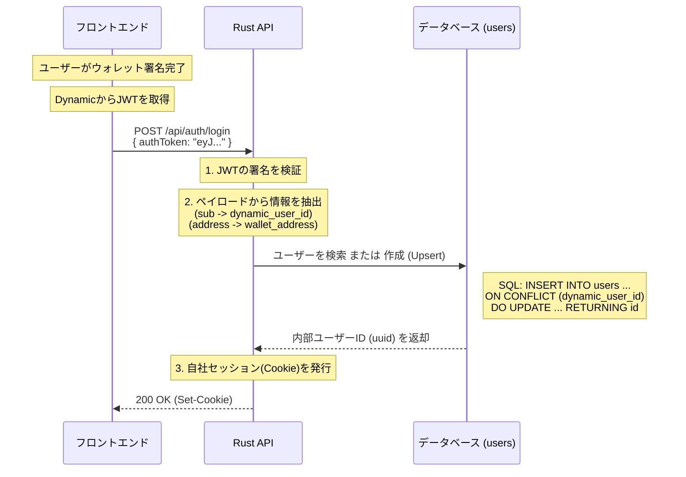

# ログイン

Upsert（アップサート）パターンによるログインAPIです。新規登録とログインを分けずに、1つのエンドポイントで処理します。この方式は Just-in-Time Provisioning とも呼ばれ、ユーザーは「登録」という行為を意識せず、「ウォレット接続したら使えるようになった」という体験を得られます。

## エンドポイント

**HTTP Method:** `POST`  
**Endpoint:** `/api/auth/login`

## 処理フロー

以下のシーケンス図に示すように、フロントエンドからDynamicで取得したJWTトークンを送信し、APIが検証・ユーザー情報抽出・Upsert処理・セッション発行を行います。



## リクエスト

### ヘッダー

| ヘッダー名 | 必須 | 説明 |
|-----------|------|------|
| `Content-Type` | 必須 | `application/json` |

### リクエストボディ

| パラメータ | 型 | 必須 | 説明 |
|-----------|----|------|------|
| `authToken` | string | 必須 | Dynamicから取得したJWTトークン |

**リクエスト例:**

```json
{
  "authToken": "eyJhbGciOiJSUzI1NiIsInR5cCI6IkpXVCJ9..."
}
```

## レスポンス

### 200 OK

ログイン成功時のレスポンスです。セッションCookie（`Set-Cookie`ヘッダー）が発行され、以降のリクエストでこのCookieを使用して認証を行います。

レスポンスボディは簡素化されており、必要最小限の情報のみを返します。

```json
{
  "userId": "550e8400-e29b-41d4-a716-446655440000",
  "walletAddress": "0x1234567890123456789012345678901234567890"
}
```

**レスポンスヘッダー:**

```
Set-Cookie: session=eyJhbGciOiJIUzI1NiIsInR5cCI6IkpXVCJ9...; HttpOnly; Secure; SameSite=Strict; Path=/
```

### 400 Bad Request

リクエストパラメータが不正な場合（例: `authToken` が未指定、形式が不正）。

```json
{
  "error": "Invalid parameter: authToken is required",
  "code": "INVALID_PARAMETER"
}
```

### 401 Unauthorized

JWTトークンの検証に失敗した場合（署名が無効、期限切れ、形式が不正など）。

```json
{
  "error": "Invalid or expired JWT token",
  "code": "INVALID_TOKEN"
}
```

## データモデル

### LoginRequest

ログインリクエスト

```typescript
interface LoginRequest {
  authToken: string; // Dynamicから取得したJWTトークン
}
```

### LoginResponse

ログインレスポンス

```typescript
interface LoginResponse {
  userId: string;        // ユーザーID（UUID形式）
  walletAddress: string; // ウォレットアドレス（0x形式）
}
```

## 実装の詳細

### 処理ステップ

1. **JWT検証**: リクエストで受け取ったJWTトークンの署名を検証します。
2. **情報抽出**: 検証済みのJWTペイロードから以下の情報を抽出します。
   - `dynamic_user_id`: JWTの `sub` クレームから取得
   - `wallet_address`: JWTの `verified_credentials` 配列の先頭、または `wallet_provider` クレーム等から取得
3. **Upsert処理**: データベースで `ON CONFLICT` 構文を使用して、ユーザーが存在しない場合は作成、存在する場合は更新（または何もしない）を1つのクエリで安全に実行します。
4. **セッション発行**: 自社のセッションCookieを発行し、以降のリクエストで認証に使用します。

### Upsert処理のメリット

- **フロントエンドがシンプル**: ユーザーが「新規か既存か」を気にする必要がありません。常に `/api/auth/login` を呼び出すだけです。
- **競合状態に強い**: Webhookとフロントエンドからのリクエストが同時に来ても、DBのユニーク制約と `ON CONFLICT` が重複登録を防ぎます。
- **ウォレット変更に対応**: 既存ユーザーが新しいウォレットアドレスで接続した場合でも、`dynamic_user_id` が同じであれば、アドレス情報が最新に書き換わります。

エラーレスポンスの共通形式については、[共通リファレンス](../00-common-reference.md#エラーハンドリング)を参照してください。
