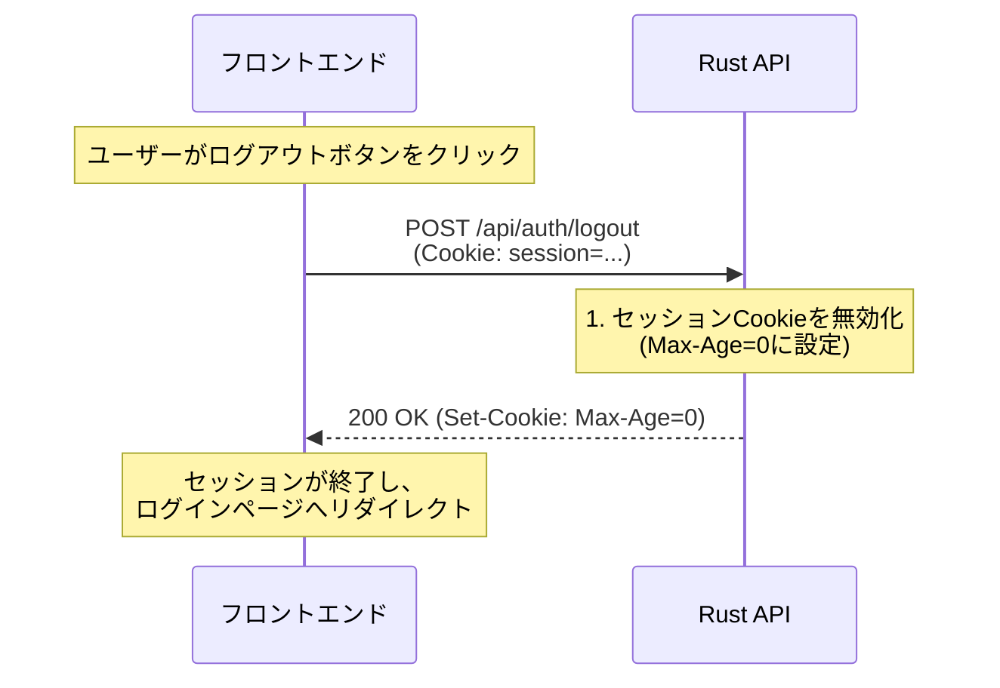

# ログアウト

ユーザーのセッションを終了し、セッションCookieを無効化するAPIです。

## エンドポイント

**HTTP Method:** `POST`
**Endpoint:** `/api/auth/logout`

## 処理フロー

以下のシーケンス図に示すように、フロントエンドからログアウトリクエストを送信し、APIがセッションCookieを無効化します。



## リクエスト

### ヘッダー

| ヘッダー名 | 必須 | 説明 |
|-----------|------|------|
| `Content-Type` | 任意 | `application/json`（リクエストボディがある場合） |
| `Cookie` | 任意 | セッションCookie（`session=...`）<br/>※認証状態でなくてもエラーにならない |

### リクエストボディ

リクエストボディは不要です。

**リクエスト例:**

```bash
curl -X POST https://api.example.com/api/auth/logout \
  -H "Cookie: session=eyJhbGciOiJIUzI1NiIsInR5cCI6IkpXVCJ9..."
```

## レスポンス

### 200 OK

ログアウト成功時のレスポンスです。セッションCookieを削除する`Set-Cookie`ヘッダーが発行されます。

```json
{
  "message": "Logged out successfully"
}
```

**レスポンスヘッダー:**

```
Set-Cookie: session=; HttpOnly; Secure; SameSite=Strict; Path=/; Max-Age=0
```

**Cookie属性の詳細:**

| 属性 | 値 | 説明 |
|------|-----|------|
| `HttpOnly` | true | JavaScriptからのアクセスを防止 |
| `Secure` | true | HTTPS通信のみで送信 |
| `SameSite` | Strict | CSRF攻撃を防止 |
| `Path` | / | すべてのパスでCookieを送信 |
| `Max-Age` | 0 | 即座に有効期限切れにしてCookieを削除 |

### 500 Internal Server Error

サーバー内部エラーが発生した場合。

```json
{
  "error": "Internal server error"
}
```

## データモデル

### LogoutResponse

ログアウトレスポンス

```typescript
interface LogoutResponse {
  message: string; // ログアウト成功メッセージ
}
```

## 実装の詳細

### 処理ステップ

1. **Cookie削除**: セッションCookieの`Max-Age`を0に設定することで、ブラウザ側でCookieを即座に削除します。
2. **レスポンス返却**: ログアウト成功メッセージを返します。

### セキュリティ考慮事項

- **冪等性**: ログアウトAPIは何度呼び出しても同じ結果になります（既にログアウト状態でも200 OKを返す）。
- **Cookie属性の一貫性**: Cookie削除時も、設定時と同じ属性（`HttpOnly`, `Secure`, `SameSite`, `Path`）を指定する必要があります。属性が異なると、ブラウザがCookieを正しく削除できない可能性があります。

### フロントエンド実装例

```typescript
const handleLogout = async () => {
  try {
    const response = await fetch('/api/auth/logout', {
      method: 'POST',
      credentials: 'include', // Cookieを送信
    });

    if (response.ok) {
      // ログアウト成功、ログインページへリダイレクト
      window.location.href = '/login';
    } else {
      console.error('Logout failed:', await response.json());
    }
  } catch (error) {
    console.error('Logout error:', error);
  }
};
```

エラーレスポンスの共通形式については、[共通リファレンス](../00-common-reference.md#エラーハンドリング)を参照してください。
