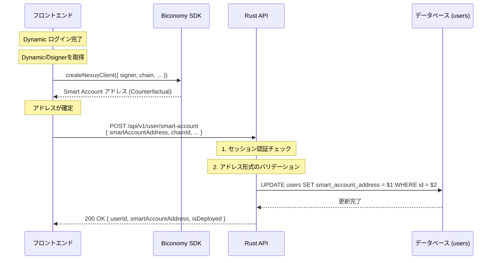

# Biconomy Smart Account 登録

フロントエンドで Biconomy SDK を用いて生成された Smart Account (Nexus) のアドレスをバックエンドに登録・保存するAPIです。これにより、ユーザーの「署名用アドレス (Dynamic EOA)」と「実行用アドレス (Biconomy Smart Account)」を紐付けます。

:::info Biconomy Mee / Nexus の概念

- **Signer (EOA)**: Dynamic で生成されたウォレット（0x...）。署名鍵として機能する。
- **Smart Account (Nexus)**: Biconomy SDK経由で作られるコントラクトウォレット。実際の資産（トークン）はここに保有させる。
- **MEE**: これらを用いてクロスチェーン取引などを実行する環境。

:::

## エンドポイント

**HTTP Method:** `POST`  
**Endpoint:** `/api/v1/user/smart-account`

## 処理フロー

Dynamic (EOA/Signer) と Biconomy Mee (Modular Execution Environment) を組み合わせる場合、「ウォレットの作成」はクライアント（フロントエンド）側の計算処理（Counterfactual Instantiation）で行われます。

サーバーサイド（Rust API）の役割は、フロントエンドで計算された Biconomy Smart Account（Nexus）のアドレスを受け取り、ユーザー情報と紐付けてDBに保存することになります。



## リクエスト

### ヘッダー

| ヘッダー名 | 必須 | 説明 |
|-----------|------|------|
| `Content-Type` | 必須 | `application/json` |
| `Cookie` | 必須 | セッションCookie（`session_id=...`）または `Authorization: Bearer <JWT_TOKEN>` |

### リクエストボディ

| パラメータ名 | 型 | 必須 | 説明 |
|------------|----|------|------|
| `smartAccountAddress` | string | 必須 | Biconomy SDKによって算出された Smart Account のアドレス (0x...) |
| `chainId` | integer | 任意 | 生成に使用したメインのチェーンID (例: 8453 for Base) |
| `moduleAddress` | string | 任意 | 使用しているバリデーションモジュールのアドレス (ECDSA, Passkey等) |

**リクエスト例:**

```json
{
  "smartAccountAddress": "0x7a250d5630B4cF539739dF2C5dAcb4c659F2488D",
  "chainId": 8453,
  "moduleAddress": "0x0000000000..."
}
```

## レスポンス

### 200 OK

登録成功時のレスポンスです。

```json
{
  "status": "success",
  "data": {
    "userId": "550e8400-e29b-41d4-a716-446655440000",
    "smartAccountAddress": "0x7a250d5630B4cF539739dF2C5dAcb4c659F2488D",
    "isDeployed": false
  }
```

**レスポンスフィールドの説明:**

| フィールド名 | 型 | 説明 |
|------------|----|------|
| `status` | string | ステータス（`"success"`） |
| `data.userId` | string | ユーザーID（UUID形式） |
| `data.smartAccountAddress` | string | 登録された Smart Account のアドレス |
| `data.isDeployed` | boolean | オンチェーンにデプロイ済みかどうか（通常は初回トランザクションまで `false` だが、アドレス自体は有効） |

### 400 Bad Request

アドレス形式が不正な場合。

```json
{
  "error": "Invalid smart account address format",
  "code": "INVALID_ADDRESS"
}
```

### 401 Unauthorized

セッションが無効、または認証に失敗した場合。

```json
{
  "error": "Unauthorized",
  "code": "UNAUTHORIZED"
}
```

## データモデル

### RegisterSmartAccountRequest

Smart Account 登録リクエスト

```typescript
interface RegisterSmartAccountRequest {
  smartAccountAddress: string;  // Biconomy SDKによって算出された Smart Account のアドレス
  chainId?: number;              // 生成に使用したメインのチェーンID
  moduleAddress?: string;        // 使用しているバリデーションモジュールのアドレス
}
```

### RegisterSmartAccountResponse

Smart Account 登録レスポンス

```typescript
interface RegisterSmartAccountResponse {
  status: "success";
  data: {
    userId: string;              // ユーザーID（UUID形式）
    smartAccountAddress: string; // 登録された Smart Account のアドレス
    isDeployed: boolean;         // オンチェーンにデプロイ済みかどうか
  };
}
```

## 実装の詳細

### 処理ステップ

1. **認証チェック**: セッションから `user_id`（自社ID）を特定する。
2. **バリデーション**: `smartAccountAddress` が有効なEthereumアドレス形式かチェックする。
3. **DB保存**: `users` テーブルの `smart_account_address` カラムを更新する。

### データベース設計

`users` テーブルに以下のカラムを追加します。

```sql
ALTER TABLE users 
ADD COLUMN smart_account_address VARCHAR(42);

-- 検索用にインデックスを貼る
CREATE INDEX idx_users_smart_account ON users(smart_account_address);
```

### フロントエンド連携フロー

実際にこのAPIを呼び出すタイミングのフローです。

1. **Dynamic ログイン**: ユーザーがウォレット接続（`/api/auth/login` 完了）
2. **Biconomy SDK 初期化**: Dynamicのsignerを使用してNexusクライアントを作成し、アドレスを取得
3. **API送信**: アドレスが取得できたらすぐにバックエンドへ登録
4. **UI表示**: 以降、アプリ内では `wallet_address` (EOA) ではなく、この `smart_account_address` をユーザーの「ウォレット」として表示・利用する

**フロントエンド実装例:**

```typescript
// フロントエンド (Next.js)
import { createNexusClient } from "@biconomy/sdk"; 

// Dynamicのsignerを使用
const nexusClient = await createNexusClient({
    signer: dynamicSigner, 
    chain: base,
    transport: http(),
    // ...
});

// ここでアドレスが確定する (Counterfactual Address)
const saAddress = await nexusClient.account.address;

// アドレスが取れたらすぐにバックエンドへ登録
await fetch('/api/v1/user/smart-account', {
    method: 'POST',
    headers: {
        'Content-Type': 'application/json',
    },
    credentials: 'include', // Cookieを送信
    body: JSON.stringify({ 
        smartAccountAddress: saAddress,
        chainId: 8453,
    }),
});
```

### 補足：Mee (Fusion) を使う場合

もし Biconomy Mee の Fusion (Cross-chain orchestration) 機能を使う場合でも、基本は「Smart Account アドレスの保存」で問題ありません。Mee は実行環境であり、資産の主体はこの Smart Account になるためです。

- **資金の預入先**: APIで登録した `smartAccountAddress`
- **署名**: Dynamic の `wallet_address` (EOA)
- **実行**: Biconomy Mee SDK
