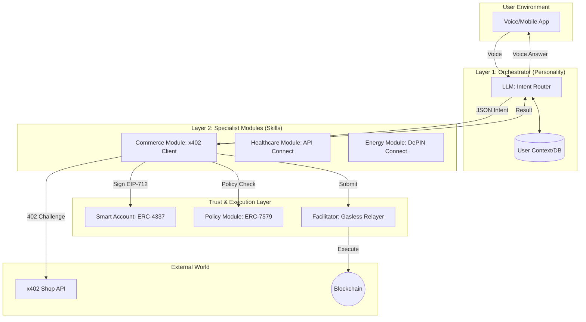

# アーキテクチャ

「AIによる推論と判断の外部化」という哲学を具現化するため、**「1つの脳（L1）と、複数の専門筋肉（L2）」**という比喩に基づくアーキテクチャを設計しました。

この設計の核心は、「ユーザーのプライバシーと人格（L1）」と「ブロックチェーン上の署名権限（L2）」を分離し、セキュリティと拡張性を両立させることにあります。

## 1. レイヤー別の責務定義

### Layer 1: Universal Orchestrator (人格・文脈レイヤー)

「何がしたいか（Intent）」を定義する責務

- **認知**: 音声(STT)から「ユーザーが今、何を望んでいるか」を抽出。
- **文脈保持**: ユーザーの好み、家族構成、過去の会話の流れを記憶。
- **意思決定**: 複数のL2モジュールのうち、どこにタスクを振るか（ルーティング）を決定。
- **フィードバック**: L2の結果を人間にわかりやすい言葉（TTS）で報告。
- **非責務**: 直接の決済署名や、商品情報の詳細検索（これらはL2に任せる）。

### Layer 2: Specialist Modules (実務・プロトコルレイヤー)

「どうやって実現するか（Execution）」を完結させる責務

- **専門知識**: 特定ドメイン（例：購買、介護、投資）の深いロジックを保持。
- **外部接続**: 専用API（x402市場など）との高度な通信。
- **権限行使**: 委譲されたセッションキー（ERC-7715）を用いて、実際の決済署名（EIP-712/2612）を生成。
- **検証**: ユーザー設定のポリシー（±10%以内など）との照合。
- **非責務**: ユーザーとの直接対話、多目的ジャンルの推論。

## 2. ターゲット・アーキテクチャ図（推奨構成）



## 3. 技術的実装のポイント

### ① L1とL2の通信：Intent-Based API

L1からL2へは、人間のような曖昧な言葉ではなく、構造化された**「Intent JSON」**を渡します。

例：

```json
{
  "action": "replenish",
  "target": "pet_food",
  "urgency": "high"
}
```

これにより、L2モジュールはプログラムとして安定して動作できます。

### ② 権限の分離：Session Key (ERC-7715)

L2（Commerce Module）には、ユーザーの全財産を操作する権限は与えません。

L1が「これは購買だ」と判断した瞬間のみ、特定の予算内でのみ有効な**「一時的な署名権限（Session Key）」**をL2に貸し出します。

これにより、L2モジュールが万が一攻撃を受けても、被害は最小限に抑えられます。

### ③ 決済の自動化：x402 + ERC-1271

L2（Commerce Module）が自律的に動くために、以下の仕組みを組み込みます。

- **x402 Client**: 402エラーを自動でハンドリングし、再試行するロジック。
- **ERC-1271 検証**: L2が生成した署名を、オンチェーンのスマートアカウントが「これは私の正当な代理人（L2）による署名である」と証明する仕組み。

## 4. この設計のメリット（なぜこれが良いのか）

### 「人格」と「能力」の分離

ユーザーにとってAIは「一人」に見えます（L1）。しかし裏側では、世界中の開発者が作った「最高に賢い買い物AI」や「最高の介護AI」をモジュールとして差し替えることができます。

### 開発コストの最小化

新しい機能を増やす際、L1（音声認識や会話）を作り直す必要はありません。特定のAPIを叩いて署名するL2モジュールを追加するだけで「できること」が増えます。

### セキュリティの階層化

音声認識をするL1サーバーに、秘密鍵を置く必要がありません。鍵の行使（判断）は、よりセキュアに隔離されたL2モジュール内で行われるため、ハッキングリスクを大幅に低減できます。

## 結論

この**「オーケストレーター（L1）＋プロトコル実行者（L2）」という2レイヤー構成こそが、x402やAccount Abstractionを最大限に活かしつつ、将来の社会インフラ（介護、電力など）への拡張を可能にする「持続可能なA2Aアーキテクチャ」**です。

## 構成

- マイク: ReSpeaker 4-Mic Array
- PC: Raspberry Pi
  - 音声を録る
  - サーバーへ送る
  - 結果を受け取る
  - 音声を鳴らす
- スピーカー: 3.5mm オーディオジャック