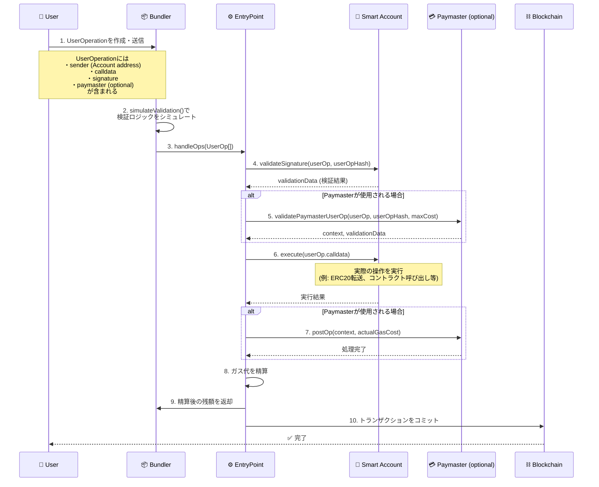

# AA

## アカウントアブストラクション（ERC-4337）のフロー

## 主要コンポーネント

### UserOperation (UserOp)
ユーザーの操作を表現する構造体。以下を含む：
- `sender`: 実行するSmart Accountのアドレス
- `calldata`: 実行したい操作のデータ
- `signature`: ユーザーの署名
- `paymaster`: ガス代を肩代わりするPaymaster（オプション）

### Bundler
複数のUserOperationを集約し、EntryPointに送信するオフチェーンのサービス。検証のシミュレーションも行う。

### EntryPoint
ERC-4337の中心的なコントラクト。以下の役割を担う：
- UserOperationの検証・実行を統括
- Smart AccountとPaymasterとのやり取りを調整
- ガス代の精算を管理
- 各チェーンに1つだけデプロイされる

### Smart Account
ユーザーのウォレットを表すコントラクト。署名の検証と実際の操作の実行を行う。

### Paymaster (オプション)
ガス代をスポンサーするコントラクト。ガスレス体験を実現するために使用される。